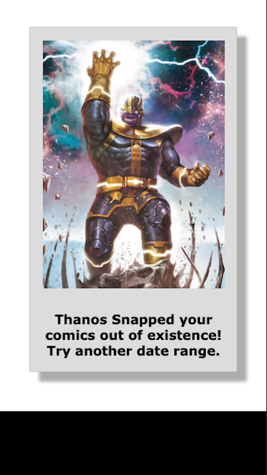
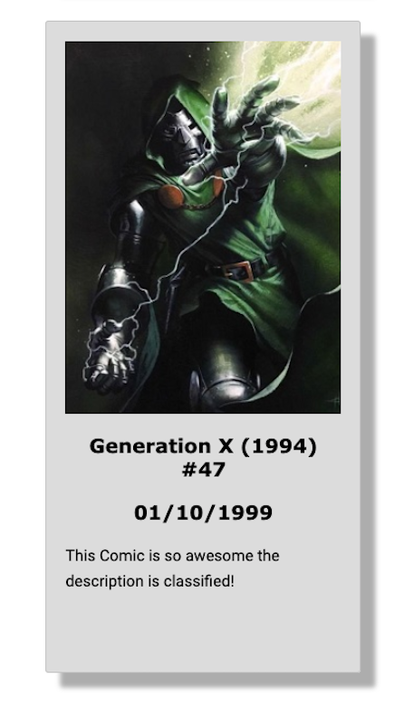
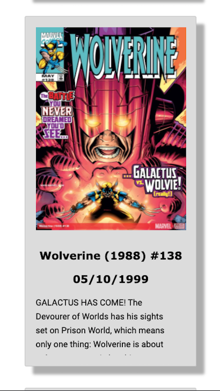

# Marvel Comics App

> An application for rendering Marvel comic book covers and description.

## Live App link

- https://wificowboy.github.io/comicsApp/

## App Images

  
  
  
  

## Summary

The Marvel Comics application allows users to search for past and present Marvel comic books. Users can enter a date range and set a limit on how many comics to display. Additionally, comics are displayed with a title, date, image, and description. Users are shown error pages if images or responses do not load from the API calls.

## Technology Stack

### Front End

- HTML5
- CSS
- JavaScript
- jQuery

### Development Environment

- Git
- GitHub
- iTerm CLI
- Visual Studio Code
- The Marvel Comics API
- Postman

## Contributors

This application was built by [Humberto Hernandez](https://github.com/WiFiCowboy), [Kevan Zameni](https://github.com/KevZam)
